# API Communication Flow: Web Controller ↔ Discord Bot Backend

```mermaid
sequenceDiagram
    participant User as User Browser
    participant Web as Web Controller<br/>(React Frontend)
    participant Bot as Discord Bot API<br/>(FastAPI Backend)
    participant Discord as Discord API
    participant DB as PostgreSQL
    participant LLM as LLM Server

    Note over User,LLM: Authentication Flow
    User->>Web: Click "Login"
    Web->>Bot: GET /api/auth/login
    Bot->>Discord: Redirect to OAuth2
    Discord->>User: Authorization page
    User->>Discord: Approve
    Discord->>Bot: GET /api/auth/callback?code=xxx
    Bot->>Discord: POST /oauth2/token<br/>(exchange code)
    Discord-->>Bot: access_token
    Bot->>Discord: GET /users/@me
    Discord-->>Bot: User info
    Bot->>Bot: Store in session
    Bot->>Web: Redirect /?auth=success
    Web->>Bot: GET /api/me
    Bot-->>Web: {user: {id, username, avatar}}

    Note over User,LLM: Guild Management
    Web->>Bot: GET /api/guilds
    Bot->>Discord: GET /users/@me/guilds
    Discord-->>Bot: User's guilds
    Bot->>Bot: Filter by bot presence
    Bot-->>Web: {guilds: [{id, name, icon}]}

    Note over User,LLM: Messages Tab
    Web->>Bot: GET /api/messages?limit=50
    Bot->>DB: SELECT from message table
    DB-->>Bot: Message rows
    Bot-->>Web: {messages: [{id, content, timestamp, type}]}

    Note over User,LLM: Events Management
    Web->>Bot: GET /api/guilds/{guild_id}/events
    Bot->>Discord: Verify user guild access
    Bot->>DB: SELECT from event table
    DB-->>Bot: Event rows
    Bot-->>Web: {events: [{event_id, name, time, details}]}

    User->>Web: Create new event
    Web->>Bot: POST /api/guilds/{guild_id}/events<br/>{user_id, time_of_event, event_name, event_details}
    Bot->>Discord: Verify user guild access
    Bot->>DB: INSERT into event table
    DB-->>Bot: event_id
    Bot-->>Web: {ok: true, event_id: 123}

    User->>Web: Cancel event
    Web->>Bot: POST /api/guilds/{guild_id}/events/{event_id}/cancel
    Bot->>DB: UPDATE event SET canceled=NOW()
    DB-->>Bot: Success
    Bot-->>Web: {ok: true}

    Note over User,LLM: Event Proposals Workflow
    Web->>Bot: GET /api/guilds/{guild_id}/proposals
    Bot->>Discord: Verify user is admin
    Bot->>DB: SELECT from event_proposal
    DB-->>Bot: Proposal rows
    Bot-->>Web: {proposals: [{proposal_id, approved, event_name}]}

    User->>Web: Approve proposal
    Web->>Bot: POST /api/guilds/{guild_id}/proposals/{proposal_id}/approve
    Bot->>DB: INSERT into event table
    Bot->>DB: UPDATE event_proposal SET approved=true
    DB-->>Bot: event_id
    Bot-->>Web: {ok: true, event_id: 456}

    User->>Web: Reject proposal
    Web->>Bot: DELETE /api/guilds/{guild_id}/proposals/{proposal_id}
    Bot->>DB: DELETE from event_proposal
    DB-->>Bot: Success
    Bot-->>Web: {ok: true}

    Note over User,LLM: Settings Management
    Web->>Bot: GET /api/guilds/{guild_id}/settings
    Bot->>DB: SELECT from guild_bot_settings
    DB-->>Bot: Settings JSON
    Bot-->>Web: {guild_id, settings: {bot_settings, role_settings, content_maturity_preferences}}

    User->>Web: Update settings
    Web->>Bot: POST /api/guilds/{guild_id}/settings<br/>{settings: {bot_settings: {personality, bot_nickname}}}
    Bot->>DB: INSERT/UPDATE guild_bot_settings
    DB-->>Bot: Success
    Bot->>Bot: If nickname changed,<br/>announce via Discord
    Bot-->>Web: {ok: true}

    Note over User,LLM: Role & Permission Management
    Web->>Bot: GET /api/guilds/{guild_id}/roles
    Bot->>Bot: Get from Discord bot cache
    Bot-->>Web: {roles: [{role_id, name, permissions}]}

    Web->>Bot: GET /api/guilds/{guild_id}/user/permissions
    Bot->>Bot: Check user roles in guild
    Bot-->>Web: {permissions: {make_events: true, manage_proposals: false}}

    Note over User,LLM: Content Violations
    Web->>Bot: GET /api/guilds/{guild_id}/offenses
    Bot->>DB: SELECT from offense table
    DB-->>Bot: Offense rows
    Bot-->>Web: {offenses: [{offense_id, body, offensive_score, time_of_offense}]}

    Note over User,LLM: Message Sending
    User->>Web: Send message to channel
    Web->>Bot: POST /api/guilds/{guild_id}/channels/{channel_id}/messages<br/>{message: "Hello"}
    Bot->>Bot: Validate permissions
    Bot->>Bot: Get personality from DB
    Bot->>LLM: Generate response with context
    LLM-->>Bot: AI response
    Bot->>Discord: Send message to channel
    Bot->>DB: Store in message table
    Discord-->>Bot: Success
    Bot-->>Web: {ok: true}

    Note over User,LLM: Logout
    User->>Web: Click "Logout"
    Web->>Bot: POST /api/logout
    Bot->>Bot: Clear session
    Bot-->>Web: {ok: true}
    Web->>Web: Clear local storage
```



## API Endpoint Summary

### Authentication Endpoints
| Method | Endpoint | Purpose | Returns |
|--------|----------|---------|---------|
| GET | `/api/auth/login` | Initiate OAuth flow | Redirect to Discord |
| GET | `/api/auth/callback` | OAuth callback handler | Redirect to frontend |
| GET | `/api/me` | Get current user info | User object or null |
| POST | `/api/logout` | Clear session | {ok: true} |

### Guild Endpoints
| Method | Endpoint | Purpose | Returns |
|--------|----------|---------|---------|
| GET | `/api/guilds` | List user's guilds with bot | {guilds: [...]} |
| GET | `/api/guilds/{guild_id}/channels` | List guild channels | {channels: [...]} |
| GET | `/api/guilds/{guild_id}/roles` | List guild roles | {roles: [...]} |
| GET | `/api/guilds/{guild_id}/user/permissions` | Get user permissions | {permissions: {...}} |

### Event Endpoints
| Method | Endpoint | Purpose | Returns |
|--------|----------|---------|---------|
| GET | `/api/guilds/{guild_id}/events` | List upcoming events | {events: [...]} |
| POST | `/api/guilds/{guild_id}/events` | Create new event | {ok: true, event_id} |
| POST | `/api/guilds/{guild_id}/events/{event_id}/cancel` | Cancel event | {ok: true} |

### Proposal Endpoints
| Method | Endpoint | Purpose | Returns |
|--------|----------|---------|---------|
| GET | `/api/guilds/{guild_id}/proposals` | List proposals (admin only) | {proposals: [...]} |
| POST | `/api/guilds/{guild_id}/proposals/{proposal_id}/approve` | Approve proposal (admin) | {ok: true, event_id} |
| DELETE | `/api/guilds/{guild_id}/proposals/{proposal_id}` | Reject proposal (admin) | {ok: true} |

### Settings Endpoints
| Method | Endpoint | Purpose | Returns |
|--------|----------|---------|---------|
| GET | `/api/guilds/{guild_id}/settings` | Get guild bot settings | {guild_id, settings, edited_at} |
| POST | `/api/guilds/{guild_id}/settings` | Update guild settings | {ok: true, settings} |

### Message Endpoints
| Method | Endpoint | Purpose | Returns |
|--------|----------|---------|---------|
| GET | `/api/messages` | Get message history | {messages: [...]} |
| POST | `/api/guilds/{guild_id}/channels/{channel_id}/messages` | Send message | {ok: true} |

### Offense Endpoints
| Method | Endpoint | Purpose | Returns |
|--------|----------|---------|---------|
| GET | `/api/guilds/{guild_id}/offenses` | List content violations | {offenses: [...]} |

## Request/Response Patterns

### Common Request Headers
```
Content-Type: application/json
credentials: include  // For session cookies
```

### Authentication Flow
1. All requests after login include session cookie
2. Backend validates session on each request
3. Protected endpoints check `request.session.get("user")`
4. Guild-specific endpoints verify user has access via Discord API

### Error Responses
```json
{
  "detail": "Error message",
  "status_code": 401/403/500
}
```

### Success Responses
```json
{
  "ok": true,
  "data": {...}
}
```

## State Management

### Frontend (React Query)
- **Query Keys**: Used for caching and invalidation
  - `['auth', 'me']` - Current user
  - `['guilds']` - User's guilds
  - `['events', guildId]` - Guild events
  - `['proposals', guildId]` - Event proposals
  - `['guildSettings', guildId]` - Guild settings
  - `['messages']` - Message history
  - `['offenses', guildId]` - Content violations

### Backend (Session)
- **Session Data**: Stored server-side, referenced by session cookie
  - `access_token` - Discord OAuth token
  - `user` - User info {id, username, avatar, email}
  - Session expires after 24 hours (86400 seconds)

### Backend (Database)
- **Persistent Storage**: PostgreSQL
  - `message` - Chat history
  - `event` - Scheduled events
  - `event_proposal` - Pending events
  - `guild_bot_settings` - Bot configuration
  - `offense` - Content violations
