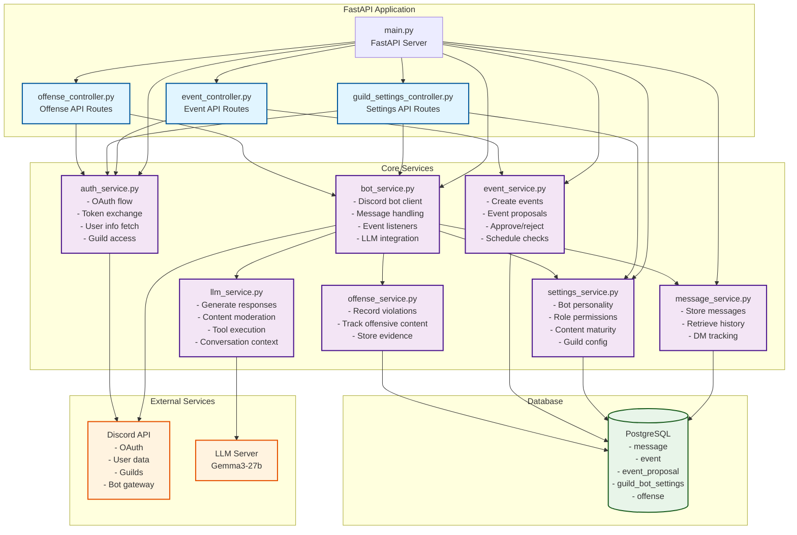

# Discord Bot Services Architecture



## Service Responsibilities

### Controllers (API Layer)
- **event_controller.py**: REST endpoints for event creation, proposals, approval/rejection
- **guild_settings_controller.py**: REST endpoints for guild configuration, roles, permissions, maturity preferences
- **offense_controller.py**: REST endpoints for retrieving content violations

### Core Services

#### auth_service.py
- Manages Discord OAuth2 authentication flow
- Exchanges authorization codes for access tokens
- Fetches user information and guild memberships
- Generates authorization URLs and handles redirects

#### bot_service.py
- Main Discord bot client using discord.py
- Registers and handles Discord events (messages, guild joins, etc.)
- Processes mentions and DMs with LLM integration
- Manages conversation history and context
- Moderates content using LLM service
- Executes bot commands (nickname changes, message sending)

#### message_service.py
- Persists all bot messages to database
- Retrieves conversation history
- Tracks DM conversations
- Filters messages by guild/channel/user

#### settings_service.py
- Stores and retrieves guild-specific bot settings
- Manages bot personality configurations
- Handles role-based permission systems
- Controls content maturity preferences

#### event_service.py
- Creates scheduled events
- Manages event proposals workflow
- Handles proposal approval/rejection
- Retrieves upcoming events
- Cancels events

#### offense_service.py
- Records content violations detected by LLM
- Stores offensive messages and attachments
- Tracks offensive scores and timestamps
- Provides violation history per guild

#### llm_service.py
- Generates AI responses using Gemma3-27b model
- Performs content moderation and scoring
- Manages tool registration and execution
- Builds system prompts with personality/context
- Handles conversation history for contextual responses

## Data Flow Examples

### 1. User Authentication
```
Client → Main → AuthSvc → Discord API → Main → Session Storage
```

### 2. Bot Receives Message
```
Discord → BotSvc → MsgSvc → DB
              ↓
         LLMSvc → LLM Server
              ↓
     Generate Response → Discord
```

### 3. Create Event
```
Client → EventCtrl → AuthSvc → Discord (verify)
              ↓
         EventSvc → DB
```

### 4. Content Moderation
```
Discord Message → BotSvc → SettingsSvc → DB (get maturity prefs)
                     ↓
                LLMSvc → LLM Server (analyze)
                     ↓
              OffenseSvc → DB (if offensive)
                     ↓
              Delete Message (if score too high)
```
